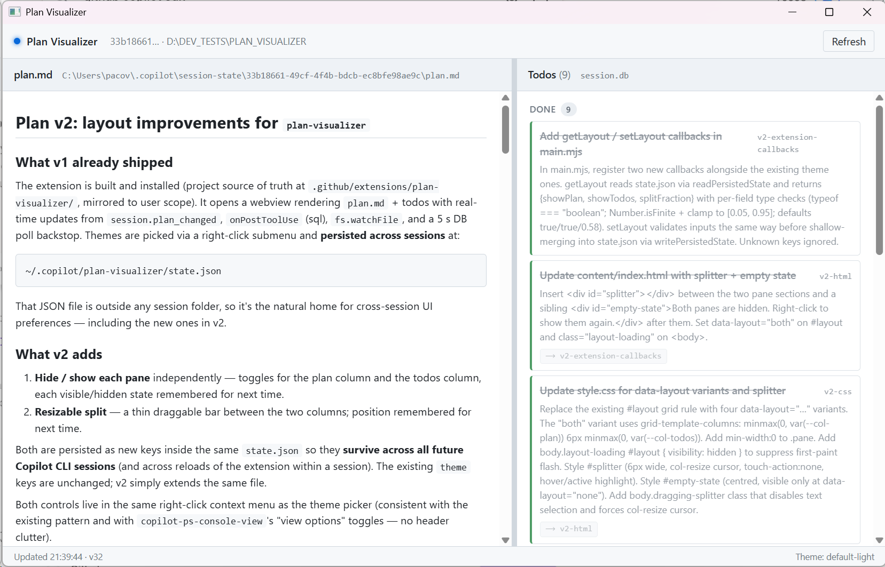

# copilot-plan-visualizer

A [GitHub Copilot CLI](https://github.com/github/copilot-cli) extension that
opens a desktop window rendering the current session's **plan** (`plan.md`)
and **plan state** (the `todos` / `todo_deps` rows in the per-session
SQLite DB), updating in real time as you and the agent change either.



## What it shows

- **Left column** — `plan.md` rendered as Markdown (with a vendored
  `marked.min.js`; no runtime CDN). Full plan path in the column header.
- **Right column** — todos grouped by status (In progress → Pending →
  Blocked → Done), each card showing the id, title, optional description
  and dependency badges (`⟶ other-todo-id`).
- **Header** — a pulsing live indicator + the session id and current
  working directory.
- **Footer** — last update timestamp, internal version counter, active
  theme.

## Real-time updates

Four trigger sources, layered for both responsiveness and resilience:

| Source | Reacts to | Latency |
| --- | --- | --- |
| `session.on("session.plan_changed")` | Plan create / update / delete via the SDK | ~50 ms |
| `hooks.onPostToolUse` (sql tool) | SQL statements touching `todos` / `todo_deps` | ~50 ms |
| `fs.watchFile(planPath, 1s)` | Direct external edits to `plan.md` | ~1 s |
| 5 s DB poll backstop | DB-level changes the hooks didn't surface | ≤ 5 s |

Pushes are debounced (50 ms), de-duplicated by content hash, and carry a
monotonic `version` integer so out-of-order pushes can't clobber the UI.

The window also **auto-opens** when a fresh `plan.md` is created
(`session.plan_changed` with `operation: "create"`).

## Requirements

- Windows 10 / 11 (the WebView2 runtime ships with the OS).
- [Node.js](https://nodejs.org/) **20 or newer** on `PATH` (`node`, `npm`).
  The extension's bootstrap uses your Node to run `npm install` on first
  launch, but the resulting native `better-sqlite3` binary is built for the
  Copilot CLI's embedded Node — see
  [Native module ABI](#native-module-abi) below for why.
- [GitHub Copilot CLI](https://github.com/github/copilot-cli) installed and
  signed in.
- (Only when installing with `-FromGitHub`) `git` on `PATH`, or
  [GitHub CLI](https://cli.github.com/) (`gh auth login`) for tarball
  fallback / private-repo access.

## Install

You can install **per-project** (only available in one repo) or **globally**
(available to your user account in every Copilot CLI session).

### From a local clone (default)

Clone the repo once, then run the installer. The script copies your
current working tree into the discovery directory — modifications,
untracked files, and feature branches are all preserved.

```powershell
git clone https://github.com/pacovidal/copilot-plan-visualizer.git
cd copilot-plan-visualizer

# Per-project (current directory must be inside a git repo)
.\scripts\install.ps1 -ProjectPath C:\path\to\my\project

# Or globally
.\scripts\install.ps1 -Scope Global
```

This places the extension at either:

- `<project>\.github\extensions\plan-visualizer\` (per-project — the
  project must be a git repository for Copilot CLI to discover it), or
- `%USERPROFILE%\.copilot\extensions\plan-visualizer\` (global).

You can delete the original clone afterwards; the installed copy is
self-contained.

### From GitHub (no clone needed)

To install in one line, without cloning, fetch the bootstrap script and
pipe it to `iex`. It will ask whether you want a per-project or global
install:

```powershell
irm https://raw.githubusercontent.com/pacovidal/copilot-plan-visualizer/main/scripts/install-remote.ps1 | iex
```

For non-interactive installs, or to override defaults like `-Ref` or
`-RepoUrl`, download the bootstrap to disk and invoke it directly. Any
arguments are forwarded to `install.ps1` (with `-FromGitHub` already set),
and passing any argument suppresses the interactive prompt:

```powershell
$bootstrap = "$env:TEMP\pviz-install-remote.ps1"
irm https://raw.githubusercontent.com/pacovidal/copilot-plan-visualizer/main/scripts/install-remote.ps1 -OutFile $bootstrap

# Globally
& $bootstrap -Scope Global

# A specific branch / tag
& $bootstrap -Ref my-feature-branch
```

If you already have a clone and just want to skip the local-copy default,
run `.\scripts\install.ps1 -FromGitHub` directly. `-Ref` and `-RepoUrl`
imply `-FromGitHub` if you pass them without it.

### Installer parameters

| Parameter      | Default              | Notes |
|----------------|----------------------|-------|
| `-Scope`       | `Project`            | `Project` or `Global` |
| `-ProjectPath` | current dir          | Only used when `-Scope Project` |
| `-FromGitHub`  | off                  | Fetch from GitHub instead of using the local working tree |
| `-Ref`         | `main`               | Only used with `-FromGitHub`. Branch or tag |
| `-RepoUrl`     | this repo            | Only used with `-FromGitHub`. Override for forks / mirrors |
| `-Force`       | off                  | Overwrite an existing install |

> Tip: if you're reinstalling and the plan-visualizer window is already
> open, **close it first**. The webview child process holds locks on a
> native module file that `Remove-Item` would otherwise fail to delete.

## Usage

After installation:

1. Reload Copilot CLI (`/reload-extensions` or restart the CLI). On
   first launch the extension's bootstrap runs `npm install` for you;
   that takes 10-30 seconds, only once.
2. Open the window with the slash command:

   ```
   /plan-visualizer
   ```

3. The window stays open for the rest of the session (or until you
   close it) and updates live as the plan and todos change.

The extension also registers three tools the agent can use directly:

- `plan_visualizer_show` — open the window (`reload: true` to refresh
  the page if it's already open)
- `plan_visualizer_eval` — run JS inside the page
- `plan_visualizer_close` — close the window

## Layout

- **Drag the thin vertical bar** between the two columns to resize the
  split. Min ~ 220 px on either side.
- **Right-click anywhere** for the context menu:
  - **✓ Show plan** — toggle the plan column.
  - **✓ Show todos** — toggle the todos column.
  - **Reset layout** — restore both panes visible and the 58 / 42 split.
  - **Refresh** — re-read state from disk.
  - **Theme ▸** — pick a built-in or user theme.
- Both panes can be hidden at once — a placeholder appears and
  right-click still opens the menu so you can re-enable a column.
- **All UI choices persist across sessions** in
  `~/.copilot/plan-visualizer/state.json` (theme, hide/show flags,
  splitter position).

## Themes

The window ships with four built-in colour schemes (`default-dark`,
`default-light`, `solarized-dark`, `solarized-light`) and picks
`default-light` or `default-dark` on first run based on your OS
appearance preference.

Switch themes via the right-click context menu → **Theme ▸**. Your
choice is remembered across sessions.

To add your own theme, drop a `.css` file into either:

- `<extension-install-dir>\themes\` (default; preserved across upgrades
  by `install.ps1`'s Save / Restore-UserThemes), or
- the directory pointed at by `$env:COPILOT_PLAN_VIZ_THEMES_DIR`.

Reopening the **Theme ▸** submenu picks up new files automatically.
User themes win over built-in themes on name collisions, so you can
override `default-dark` with your own. See
[`content/themes/README.md`](content/themes/README.md) for the full
variable reference and a copy-pastable starter template.

## Persistence

All UI choices live in **one** JSON file:

```
~/.copilot/plan-visualizer/state.json
```

```json
{
  "theme": "default-dark",
  "themeMode": "dark",
  "showPlan": true,
  "showTodos": true,
  "splitFraction": 0.58
}
```

Old files with only the theme keys keep working — the layout fields
default in. Hand-edited junk (non-booleans, out-of-range fractions) is
ignored on load and on save.

## Native module ABI

`better-sqlite3` is a native module. Copilot CLI ships its own embedded
Node (currently version 24, ABI 137); your system Node may be a
different version (Node 22 = ABI 127, etc.). If `npm install` is run
under your system Node, `prebuild-install` fetches the wrong ABI binary
and `better-sqlite3` fails to load — which would silently zero out the
todos panel.

The extension handles this transparently: `extension.mjs` sets
`process.env.npm_config_target = process.versions.node` before its
bootstrap runs `npm install`, so the binary is fetched for the *CLI's*
Node, not yours. As long as the install script doesn't pre-run
`npm install` itself (it doesn't — by design), this Just Works.

If you ever see "better-sqlite3 not loaded" in the todos panel, run:

```powershell
cd "$env:USERPROFILE\.copilot\extensions\plan-visualizer"
Remove-Item -Recurse -Force node_modules, package-lock.json
# Then reload Copilot CLI; the extension's bootstrap will reinstall
# under the correct Node ABI.
```

## Uninstall

```powershell
# Per-project (run from inside the project)
.\scripts\uninstall.ps1

# Global
.\scripts\uninstall.ps1 -Scope Global
```

User themes in `<install-dir>\themes\` are deleted along with the rest
of the install (you'll be warned first). Persisted UI choices at
`~\.copilot\plan-visualizer\state.json` are NOT removed — re-installing
later picks up your old theme and layout.

## Development

```powershell
git clone https://github.com/pacovidal/copilot-plan-visualizer.git
cd copilot-plan-visualizer
npm install   # only needed for tooling like scripts\bake-icon.mjs
```

For an iterative loop, install globally with `-Force`, edit, then
reload:

```powershell
.\scripts\install.ps1 -Scope Global -Force
# /reload-extensions inside Copilot CLI to pick up changes to main.mjs
# or lib/. For content/ edits, plan_visualizer_show -reload true is enough.
```

The webview child process holds a lock on the `@webviewjs/webview`
native module, so close the window before re-running install.ps1.

There are no tests, lint, or build steps in this repo.

## Thanks

This extension was originally built with the help of [Copilot WebView Creator](https://github.com/SteveSandersonMS/copilot-webview-creator) 


## License

MIT — see [LICENSE](./LICENSE).